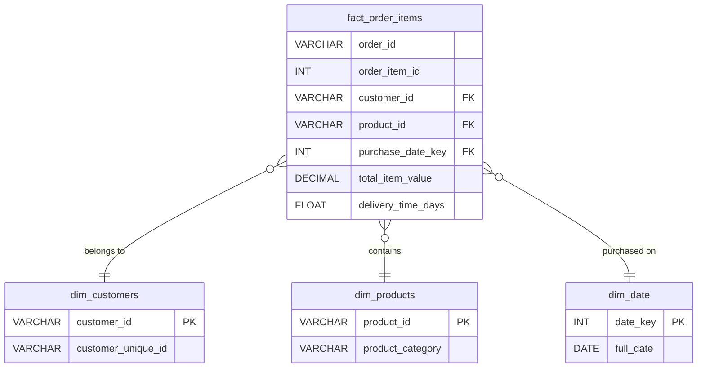

# Olist Ecommerce Analytics & Prediction Pipeline

**End-to-end data engineering and machine learning pipeline for the Olist Brazilian E-Commerce dataset.**

## Overview

This repository demonstrates a complete data lifecycle for e-commerce product analytics. It is split into two major components:
1. **Data Engineering (SQL)**: A dimensional star schema and robust product analytics metrics built in PostgreSQL to evaluate cohort retention and logistics.
2. **Machine Learning (Python)**: An advanced predictive pipeline focusing on customer retention, churn modeling, and synthetic data augmentation.

## Project Structure

```text
├── data_engineering/
│   └── sql/
│       ├── 01_raw_layer.sql                 # DDL for loading raw data
│       ├── 02_data_quality_checks_raw.sql   # QA queries (nulls, orphaned keys)
│       ├── 03_cleaning_and_staging.sql      # Data cleansing and business logic
│       ├── 04_data_modeling.sql             # Dimensional Star Schema
│       ├── 05_product_metrics.sql           # BI queries (Cohorts, Repeat Rates)
│       └── 06_performance_optimization.sql  # Indexing & Partitioning
├── data/
│   ├── raw/             # Original Olist data
│   └── processed/       # Cleaned data ready for ML modeling
├── notebooks/           
│   └── 01_End_to_End_Pipeline.ipynb # Main Machine Learning notebook
├── src/                 # Source code 
├── models/              # Saved trained ML models
├── requirements.txt     # Python dependencies
└── README.md
```

## Part 1: Data Engineering & Product Analytics

The `data_engineering/` folder transforms raw relational data into a **Star Schema** optimized for BI. 

**Key Highlights:**
- **Data Quality:** Automated checks for nulls, orphaned keys, and illogical delivery dates.
- **Data Modeling:** Dimensional modeling (Fact and Dimension tables) to simplify downstream aggregations.
- **Product Analytics:** Advanced SQL utilizing Window Functions (`ROW_NUMBER()`, `LAG()`) to calculate Cohort Retention, Repeat Purchase Rates, and Monthly Active Purchasers.
- **Performance:** Implemented strategic indexing for query optimization.

### Data Model (Star Schema)



## Part 2: Machine Learning & Churn Prediction

The `notebooks/` and `src/` folders handle the data science workflow, focusing on predicting customer churn based on the engineered features.

**Key Features:**
- **RFM Analysis**: Recency, Frequency, Monetary value calculations.
- **Delivery Metrics**: Analysis of delivery times, lateness, and approval times.
- **Synthetic Data Augmentation**: Techniques to expand the dataset for better model training.
- **Predictive Modeling**: Trained XGBoost, Logistic Regression, and Random Forest models.
- **Forecasting**: Time series forecasting using Prophet.

## Installation & Setup

1. **Clone the repository**:
   ```bash
   git clone https://github.com/jiya2000/customer-retention-insights-olist.git
   cd customer-retention-insights-olist
   ```

2. **Install Python Dependencies (for ML Pipeline)**:
   ```bash
   pip install -r requirements.txt
   ```

## Usage

- **For Data Engineering**: Review the SQL scripts in the `data_engineering/sql/` directory. These can be executed in any PostgreSQL environment.
- **For Machine Learning**: Navigate to `notebooks/` and open `01_End_to_End_Pipeline.ipynb`. The notebook will automatically download the required datasets using `kagglehub`.
